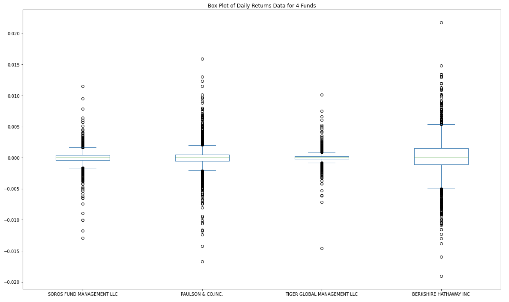

# Module_4 Challenge - Risk Return Analysis

This project examines some historical data on the investment returns for four whale fund managers for the period October 1, 2014 through September 11, 2020.  The aim is to find the one fund with the most investment potential based on the key risk_management metrics: daily returns, standard deviations, Sharpe ratios, and betas.  These metrics will be compared to the S&P 500 Index to help evaluate their risk and return relative to the market as a whole.

---

## Technologies

This project leverages python 3.7.11 with the following packages:

* [pandas](https://pandas.pydata.org) - Use the Pandas library, along with JupyterLab, to collect, prepare and analyze data.

* [pathlib](https://docs.python.org/3/library/pathlib.html) - Allows for consistent input of source csv files.

* [numpy](https://numpy.org) - Numerical computing tools, specifically the square root function for this project.

* [matplotlib](https://matplotlib.org) - For plotting the data on line graphs and box plots.

---

## Installation Guide

Before running the application first import the following libraries:

```python
  import pandas as pd
  from pathlib import Path
  import numpy as np
  %matplotlib inline
```

---

## Usage and Summary Analysis

To run the Risk Return Analysis, simply clone the repository and then run Jupyter Lab to open the Jupyter notebook named risk_return_analysis.ipynb.

Upon launching, the Jupyter notebook flows as follows:

We first import the fund data stored in the Resources folder, calculate the daily percentage returns for each portfolio and store these in a dataframe to be used in our Quantitative Analysis.

1.  Analyze the Performance.  Not one of the four funds we looked at came close to outperforming the S&P 500 Index.  Berkshire Hathaway was clearly the best performer of the four, and the Tiger Global portfolio was the only other one that earned positive returns over the 6 years we examined.

    

2.  Analyze the Volatility.  Box plots were used to determine that the S&P 500 was far more volatile than any of the four portfolios.  Of these four portfolios, Berkshire Hathaway was the most volatile, while Tiger Global showed the least amount of volatility.

    

3.  Analyze the Risk.  The annualized standard deviations of the rolling 21-day averages show that all four portfolios pose significantly less risk than the S&P 500 index. Berkshire Hathaway carried the most risk of the four, but Tiger Global has matched it the past couple of years.  The risk of each of the four funds have been trending up recently.

    
    
4.  Analyze the Risk-Return Profile.  Using Sharpe ratios of annualized returns and standard deviations for each portfolio, we can safely eliminate the Paulson & Co and the Soros Fund from consideration.  The inability of both of these funds to generate positive returns is more than enough to offset their relatively low risk and volatility.  Of the remaining portfolios, Tiger Global has a Sharpe ratio nearly identical to that of the S&P 500, while Berkshire Hathaway has the best Sharpe ratio of all.

    
    
5.  Diversify the Portfolio.  With a much higher Beta than the Tiger Global portfolio, the Berkshire Hathaway portfolio is more sensitive to movements in the S&P 500.  However, recent trends show that Tiger Global's beta has been on the rise.  This means that Tiger's biggest advantage over Berkshire Hathaway, specifically its lower risk of fluctuating wildly with market swings, has been diminished as of recently.  The 60-day rolling beta for Berkshire Hathaway had been significantly higher than that of Tiger Global for the past 4 years or so, but these betas have been much closer to each other since March of 2020.  See the graph below for visualizations of each fund's rolling 60-day betas:

    
    
The Berkshire Hathaway portfolio is my recommendation.  Compared to Tiger Global Management, it has the greatest risk-return profile based on their respective Sharpe ratios.  The Tiger portfolio could be considered a better fit for investors who are at or near their retirement, since it offers very low risk (though that risk has been trending upwards) but still provides a postive investment return.  And for the youngest of investors just out of college and starting their retirement savings, an S&P 500 Index Fund could be a good fit with its high risk but high return potential.  But if we can only add one fund to our list of investment options, the Berkshire Hathaway portfolio offers the best mix of those other two.

---

## Contributors

Starter code was provided by UW Fintech Bootcamp.  Updates and analysis by Jason Buckholt.  

---

## License

When you share a project on a repository, especially a public one, it's important to choose the right license to specify what others can and can't with your source code and files. Use this section to include the license you want to use.

For now, only a License to Ill is needed.
